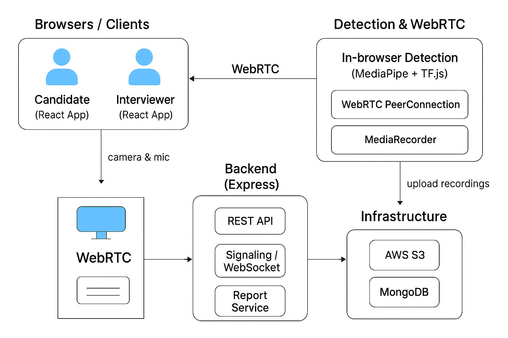

# Focus & Object Detection in Video Interviews

## 📄 Overview

This project implements a **real-time video proctoring system** for online interviews. It helps interviewers monitor candidates’ focus and detect unauthorized items during a live interview session. The system uses **computer vision and object detection techniques** to generate an automated **Proctoring Report** that summarizes the candidate’s attentiveness and potential suspicious activity.

The solution is ideal for **remote hiring, online assessments, and academic proctoring**.

---

<!-- Requirement Gathering Section -->

## 🎯 Gathered Requirements

### Real-Time Candidate Monitoring
- Candidate and interviewer video streaming.
- Display candidate video to interviewer in real-time.
- Candidate video recording for audit purposes.

### Focus Detection
- Detect if candidate is looking away from the screen for more than **5 seconds**.
- Detect absence of face for more than **10 seconds**.
- Detect multiple faces in the frame (possible cheating attempt).
- Log all events with timestamps.

### Item / Note Detection
- Detect unauthorized objects such as:
  - Mobile phones
  - Books / paper notes
  - Extra electronic devices
- Log events with timestamps.

### Reporting
- Generate a detailed **Proctoring Report** including:
  - Candidate name
  - Interview duration
  - Number of times focus lost
  - Suspicious events (multi-face, absence, phone/notes)
  - Final Integrity Score (**100 – deductions**)

### Optional Backend
- Store logs in a database (MongoDB / MySQL / Firebase).
- Provide REST API to fetch proctoring reports.

### image


---

<!-- Architecture Section -->

## 🏗 High-Level Design Architecture



## ✨ Features

- **Real-time Video Streaming**  
  Uses WebRTC to stream candidate and interviewer video in real-time.

- **Focus Detection**  
  Tracks candidate attention and face presence.

- **Object Detection**  
  Flags unauthorized objects such as phones, notes, or other devices.

- **Event Logging**  
  All events are recorded with timestamps for auditing purposes.

- **Proctoring Report**  
  - Candidate details  
  - Event summary  
  - Integrity score  
  - PDF download option

- **Role-based Interface**  
  Separate dashboards for Candidate and Interviewer.

- **Optional Backend Storage**  
  Supports MongoDB or Firebase for storing logs and reports.

- **Bonus Features (Optional)**  
  - Eye closure / drowsiness detection  
  - Real-time alerts for interviewer  
  - Audio detection (background noise)

---

## 🛠 Technology Stack

- **Frontend:** React, TypeScript, WebRTC, TailwindCSS, WebSocket, Socket.IO, 
- **Computer Vision:** TensorFlow.js / MediaPipe / OpenCV.js  
- **Backend:** Node.js, Express.js  
- **Database (Optional):** MongoDB / Firebase  
- **Logging:** Bulk logger system  
- **Report Generation:** JSON & PDF export
- **AWS:** S3 (video storage recorded)

---

## 🚀 Getting Started

### Prerequisites
- Node.js >= 18.x
- npm / yarn
- MongoDB (if using backend)

### Clone the Repository
```bash
git clone <YOUR_REPO_URL>
cd focus-object-detection-interview
```

### Install Dependencies - Frontend & Backend 
```bash
# Frontend 
cd frontend
npm install


cd ../backend
npm install
```

### Run Backend
```bash
cd backend
npm run dev
```

### Available API's

-**POST /api/logs** Store detection events
-**PATCH /api/sessions/:sessionId/end** Mark interview ended
-**GET /api/reports/:sessionId** Fetch proctoring report

### Access Interview Pages
-**Interviewer:** http://localhost:4000/interview?role=interviewer
-**Candidate:** http://localhost:4000/interview?role=candidate

### Features
-**Start/End** Interview
-**Real Time** Detection Overlay
-**Report** Report After Interview

---

## 📄 Sample Report

The proctoring report contains candidate details, interview duration, event summaries, and the integrity score. It can also be downloaded as a PDF.

### Example Report Fields
- **Candidate:** John Doe  
- **Duration:** 25m 32s  
- **Focus lost:** 3  
- **Absences:** 1  
- **Multiple faces detected:** 0  
- **Objects detected:** phone x1  
- **Integrity Score:** 92/100  

**PDF Download:** Available via report PDF link

---

## 💡 Tips & Best Practices

- **Camera Permissions:** Ensure the browser has camera and microphone access.  
- **WebRTC:** Works best on Chrome or Edge; Safari may have some limitations.  
- **Logging:** Logs are batched for performance. Make sure to flush logs before ending the session.  
- **Proctoring Report:** Always fetch the report after clicking **End Interview** to view the final events and integrity score.

---

## 🚀 Future Enhancements

- **Log Caching:** Implement client-side caching of detection events to handle network interruptions and ensure no data loss.  
- **Microservices Architecture:** Separate detection, logging, and reporting into independent microservices for better scalability and maintainability.  
- **Advanced Analytics:** Integrate AI-based sentiment analysis or gaze tracking for more accurate focus evaluation.  
- **Real-time Alerts:** Notify interviewers instantly if suspicious activity is detected.  
- **Cross-Platform Support:** Extend compatibility to mobile browsers and Safari.  
- **Enhanced Report Formats:** Support CSV, Excel, or interactive dashboards for proctoring reports.

---

## 📖 Conclusion

This project demonstrates a comprehensive real-time video proctoring system for online interviews, combining focus and object detection with automated reporting. It enables interviewers to monitor candidates efficiently while maintaining data-driven insights for integrity and performance evaluation.

Thank you for exploring this project!


